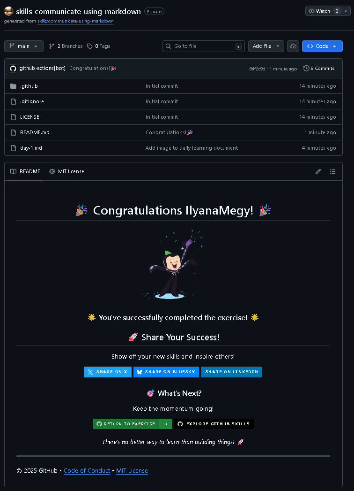

# Communicate using Markdown

Exercise completed from GitHub Skills.

Original exercise:  
https://github.com/skills/communicate-using-markdown

## Objective

Learn how to use Markdown to format text and communicate clearly on GitHub.

## Skills learned

- Writing Markdown
- Creating headings
- Formatting text (bold, italic)
- Adding lists
- Inserting images
- Creating links

## Proof of completion

