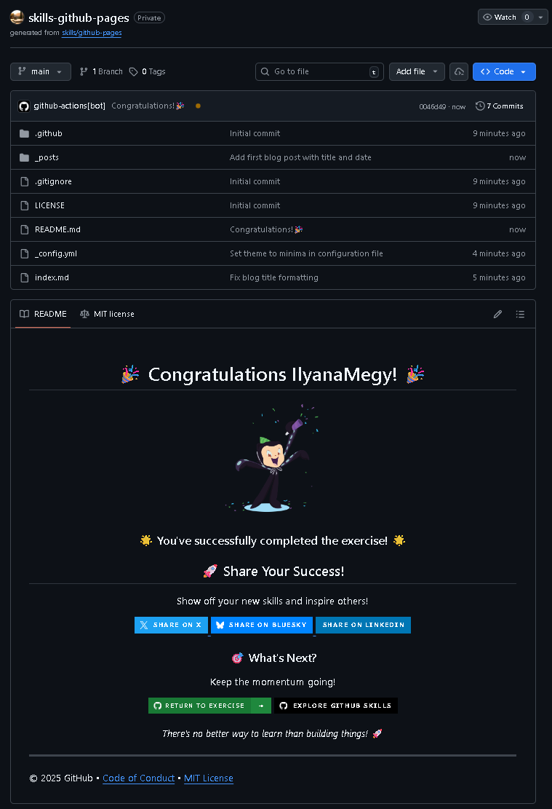

# GitHub Pages

Exercise completed from GitHub Skills.

Original exercise:  
https://github.com/skills/github-pages

## Objective

Learn how to publish a website using GitHub Pages.

## Skills practiced

- Creating a GitHub Pages site
- Using a repository to host a website
- Editing Markdown content
- Publishing a page with GitHub Pages
- Viewing the deployed website

## Proof of completion

