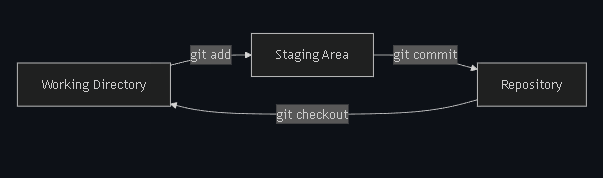
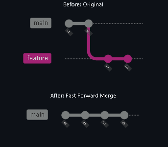
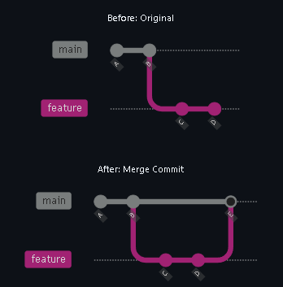
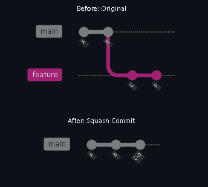

# Git memo

## Basics



- **git init** - Start a new repository to enable versioning.
- **git add** - Group related changes together in the staging area, in preparation to "commit" them to history.
- **git commit** - Save or "commit" the changes in the staging area to the project's history.
- **commit message** - A short description of the changes to help keep the history organized.
- **git status** - View the current state of your working directory and staging area.
- **git checkout** - Change your working directory to a different version from the repository history.

## History
Git maintains a complete history of your project through commits. Each commit contains:

- **Unique hash ID**: A unique identifier to easily reference it in the history.
- **Parent commit**: Reference to the previous commit, creating a chain.
- **Author information**: Who made the changes.
- **Timestamp**: When the changes were applied.
- **Commit message**: Description of the changes included in that commit.

Additionally, the HEAD pointer is a special label that indicates your current position in the project history. Your project probably looks similar to the below diagram.

```bash
git log --graph --oneline
git checkout <id-commit>  # checkout the id-commit version
```

The git diff command shows differences between development states.

- **git diff** - Differences between the working directory and the staging area.
- **git diff --staged** - Differences between staging area and previous commit.
- **git diff HEAD~1** - Differences between current commit and previous commit.

## Understanding Branches
Branches in Git are lightweight pointers (like labels) to specific commits. This allows working on a dependent version without influencing the original, which is great for parallel feature development and collaboration.

Key Concepts:

- **main Branch**: Usually the trusted working version, and the first branch. (historically called master)
- **Feature Branch**: A safe isolated space to develop without affecting the trusted version.
- **Merging**: Combining changes from different branches.

**How do you combine branches?**

There are multiple strategies for organizing commits. Usually, all in the name of different styles of **organization**, **transparency**, and **traceability**. Let's introduce the most common.

### Fast-forward merge : Move the new commits from the child branch onto the parent branch.



### Merge commit: Apply the changes as a single new commit on the parent branch. Leave the child branch in the network for traceability.



### Squash merge: Collapse the commits from one branch into a single new commit on the other branch.



**What are the important Git commands?**

- **git branch my-new-feature** - Start a branch from the current branch.
- **git checkout my-new-feature** - Change your working directory to a different version from the repository history.
- **git merge** - Apply the commits from one branch onto another branch. (Default: Fast forward merge)
