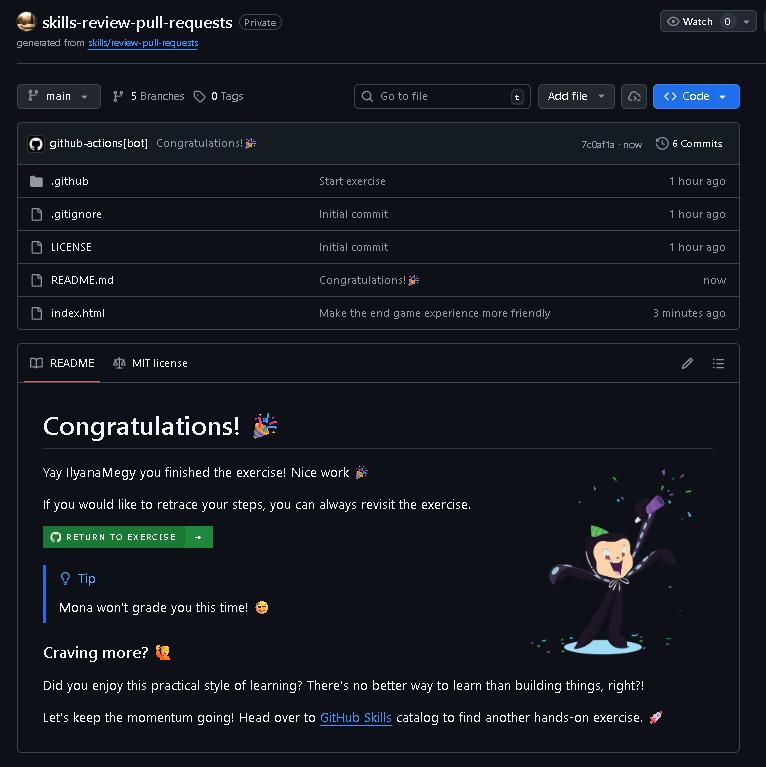

# Review Pull Requests

Exercise completed from GitHub Skills.

Original exercise:  
https://github.com/skills/review-pull-requests

## Objective

Learn how to review pull requests on GitHub and collaborate effectively with other developers.

## Skills practiced

- Reviewing code changes
- Commenting on pull requests
- Approving or requesting changes
- Understanding the pull request workflow
- Collaborating in a team environment

## Concepts learned

- Pull request basics
- Code review best practices
- GitHub collaboration workflow
- Managing feedback and iterations

