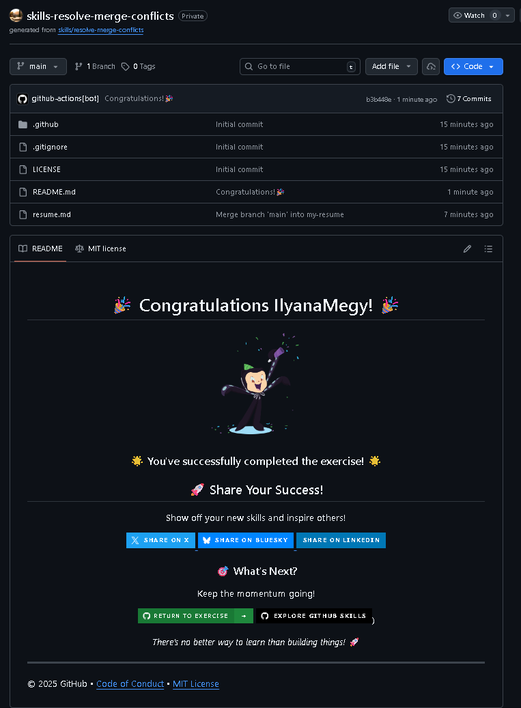

# Resolve Merge Conflicts

Exercise completed from GitHub Skills.

Original exercise:  
https://github.com/skills/resolve-merge-conflicts

## Objective

Learn how to identify and resolve merge conflicts in Git, ensuring a smooth workflow when collaborating on projects.

## Skills practiced

- Understanding merge conflicts
- Resolving conflicts manually
- Using Git commands to merge branches
- Committing resolved changes
- Collaborating effectively with a team

## Concepts learned

- Git merging basics
- Conflict resolution strategies
- Branch management
- Maintaining a clean Git history

