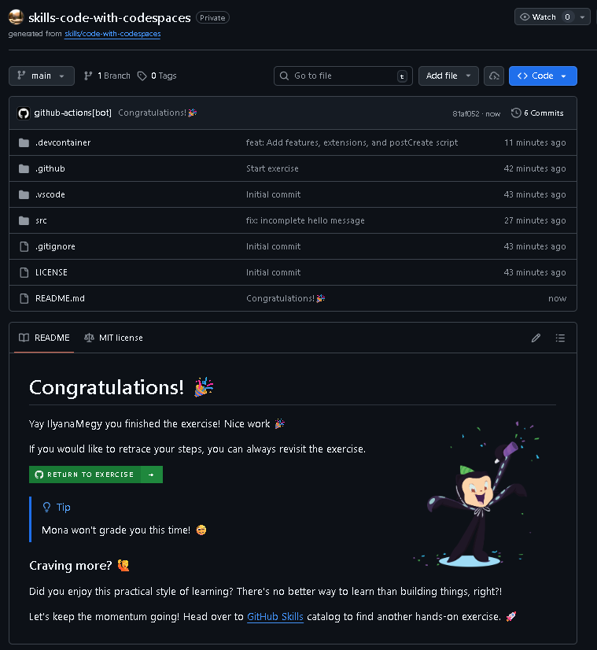

# Code with Codespaces

Exercise completed from GitHub Skills.

Original exercise:  
https://github.com/skills/code-with-codespaces

## Objective

Learn how to develop directly in the cloud using GitHub Codespaces, a fully configured development environment.

## Skills practiced

- Launching a GitHub Codespace
- Working in a cloud development environment
- Editing and running code inside Codespaces
- Committing and pushing changes to GitHub
- Understanding remote development workflows

## Concepts learned

- Cloud-based development environments
- GitHub Codespaces workflow
- Remote coding setup
- Integrated development tools in GitHub

