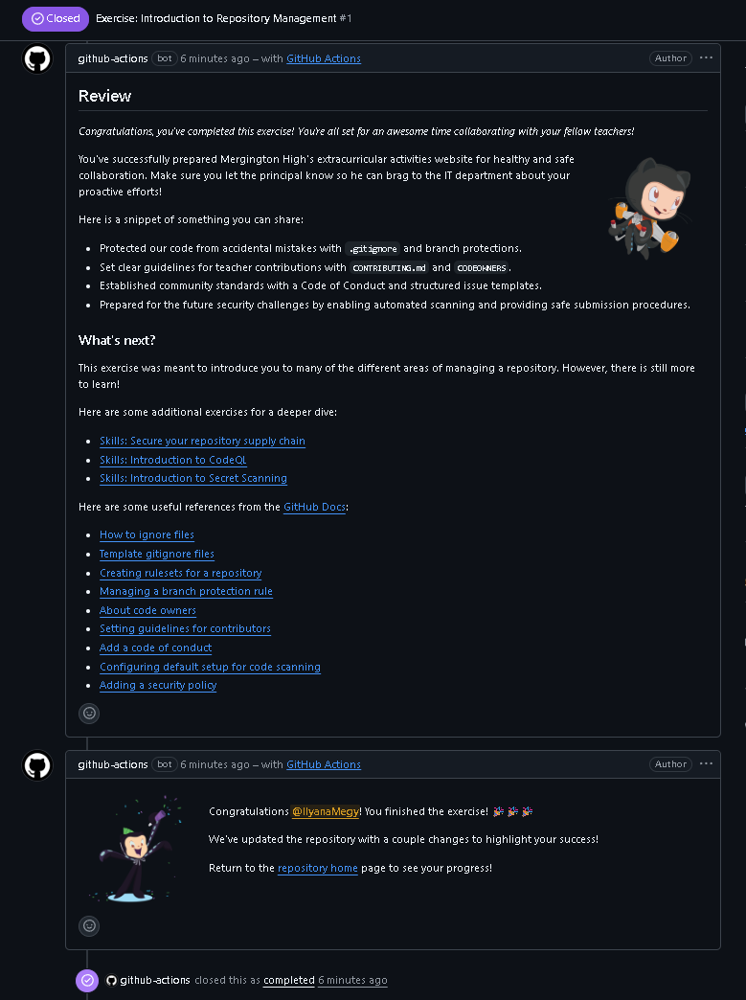

# Introduction to Repository Management

Exercise completed from GitHub Skills.

Original exercise:  
https://github.com/skills/introduction-to-repository-management

## Objective

Learn how to manage a GitHub repository by configuring settings, managing collaborators, and organizing project workflows.

## Skills practiced

- Configuring repository settings
- Managing branches and protections
- Adding collaborators
- Creating and managing issues
- Understanding repository administration

## Concepts learned

- Repository management basics
- Access control and permissions
- Branch protection rules
- Collaboration workflows on GitHub

