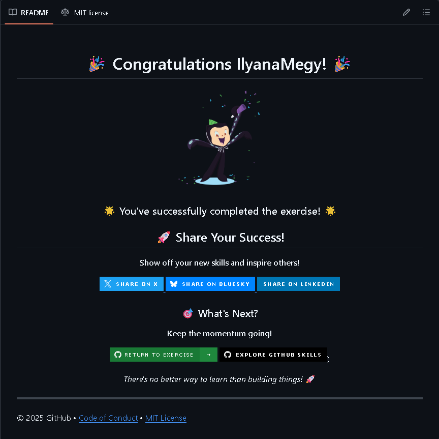

# Introduction to GitHub

Exercise completed from GitHub Skills.

Original exercise:
https://github.com/skills/introduction-to-github

## Skills learned

- Creating a repository
- Working with branches
- Opening pull requests
- Merging pull requests
- Basic GitHub workflow

## Proof of completion

